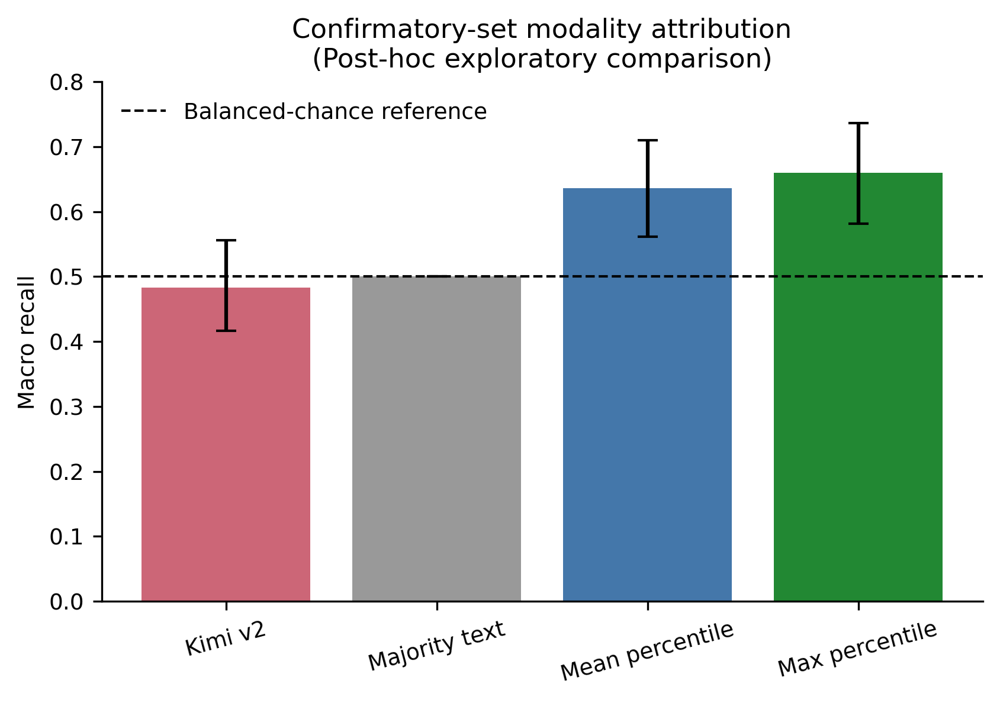
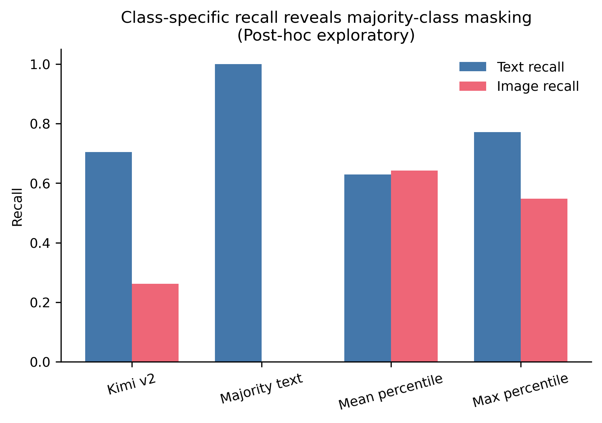
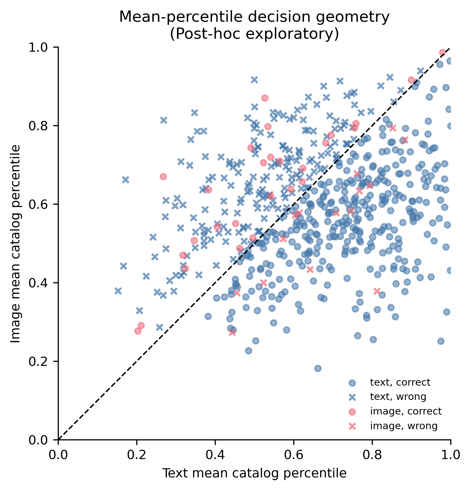
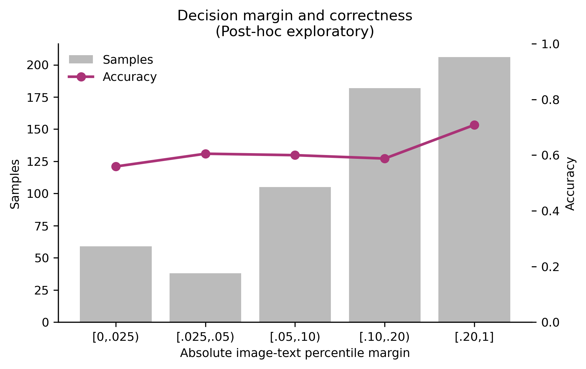

# Day 18：Mean Percentile 机制审计与论文图

## Material Passport

- Origin Skill：academic-research-suite / experiment-agent
- Origin Mode：run + validate
- Origin Date：2026-08-11
- Verification Status：POSTHOC EXPLORATORY VERIFIED
- Version Label：`mean_percentile_mechanism_v1`
- Protocol Commit：`29f8018`（先于机制分析）
- Parent Protocol：Day 17，commit `eefcfca`
- Scope：590 条正式确认样本；新增 API 请求 0 条
- Overall Confidence：CAUTION（机制结果可复现，但属于事后探索）

## 1. 核心发现

Mean Percentile 与 Max Percentile 是否给出相同预测，是比 Mean 自身 margin 更清晰的无标签风险信号：

| Mean/Max 状态 | n | 覆盖率 | Mean accuracy | Max accuracy | Mean macro recall | Max macro recall |
|---|---:|---:|---:|---:|---:|---:|
| 一致 | 420 | 71.19% | 77.14% | 77.14% | 72.91% | 72.91% |
| 不一致 | 170 | 28.81% | 28.24% | 71.76% | 42.00% | 58.00% |

一致组同时保持 text recall 77.64% 和 image recall 68.18%。这表明 Mean 与 Max 的一致性可以作为无需答案的可靠性提示：覆盖约 71% 样本时，宏召回从全量 Mean 的 63.62% 提升到 72.91%。这是事后发现，未来必须在新数据上验证后才能作为正式拒答机制。

不一致组中 Max 明显优于 Mean，也解释了为什么 Day 17 的 Max 全量点估计略高。但 Max 是冻结的次要基线，不能在当前正式集上被重新包装为预先指定的主方法。

## 2. Margin 假设只得到部分支持

| 绝对 margin | n | Accuracy | Text n/recall | Image n/recall |
|---|---:|---:|---:|---:|
| [0, .025) | 59 | 55.93% | 56 / 53.57% | 3 / 100.00% |
| [.025, .05) | 38 | 60.53% | 31 / 58.06% | 7 / 71.43% |
| [.05, .10) | 105 | 60.00% | 94 / 59.57% | 11 / 63.64% |
| [.10, .20) | 182 | 58.79% | 168 / 59.52% | 14 / 50.00% |
| [.20, 1] | 206 | 70.87% | 199 / 70.85% | 7 / 71.43% |

最大 margin 层准确率最高，但中间四层并不单调。因此不能把绝对 margin 直接解释成校准概率，也不应立即据此设阈值。第一层只有 3 个 image、最后一层只有 7 个 image，层内宏召回非常不稳定；表格保留类别计数以防基率忽视。

## 3. Mean 与 Kimi 的互补关系

| 情况 | 全部 | Text 真值 | Image 真值 |
|---|---:|---:|---:|
| 两者都对 | 242 | 234 | 8 |
| 只有 Mean 对 | 130 | 111 | 19 |
| 只有 Kimi 对 | 155 | 152 | 3 |
| 两者都错 | 63 | 51 | 12 |

Kimi 在 text 类多挽回 41 条净样本（152−111），而 Mean 在 image 类多挽回 16 条净样本（19−3）。因此 Mean 的优势不是全面替代 Kimi，而是显著修复 Kimi 的 image 识别短板；Kimi 较高的普通准确率则主要来自占 92.88% 的 text 类。

这也说明一个潜在但尚未验证的方向：未来可以在独立开发区研究 Kimi 与确定性相似度信号的组合，但不能用当前 590 条正式集选择组合规则。

## 4. 决策几何与确定性案例

散点图显示大量 text 真值位于决策线两侧，说明“视觉历史看起来更相似”并不等价于推荐模型实际更依赖图像。最强 margin 的错误也并非只出现在边界附近，例如：

- `baby-u5977-i926`：text 真值，Mean 强烈预测 image，image/text 百分位为 0.814/0.268；
- `baby-u9680-i626`：image 真值，Mean 强烈预测 text，image/text 百分位为 0.379/0.812。

案例由协议规定的绝对 margin 与 `sample_id` 排序自动选出，没有人工挑选。完整的每类 5 个最强错误与 5 个最小 margin 正确案例保存在机器 JSON 中。案例只用于展示机制边界，不能用来发明新的事后类别或调规则。

## 5. 论文图

### Figure 1：宏召回与不确定性

Kimi 的宏召回区间跨越 0.5；两种非 LLM 基线的区间整体更高。该图必须保留“Post-hoc exploratory”标记。

### Figure 2：分类别召回

该图直观显示 Majority Text 和 Kimi 的 text/image 不平衡，以及 Mean Percentile 更接近平衡的召回结构。

### Figure 3：Mean Percentile 决策空间

虚线为 `image=text` 决策边界；圆点为正确，叉号为错误。红色 image 真值只有 42 条，必须结合类别不平衡理解。

### Figure 4：Margin 诊断

只有最大 margin 层表现明显提高，中间区间不呈单调校准关系。

每张图同时提供可编辑 SVG。

## 6. 完整性与复现

- 590/590 样本、583 位唯一用户、459 个唯一目标商品；
- 精确复现 Day 17：accuracy 63.05%、text recall 62.96%、image recall 64.29%、macro recall 63.62%；
- 图像和文本计算均使用 CPU；
- JSON、PNG、SVG 将进行连续两次运行的逐文件 SHA-256 检查；
- 机器结果：`data/manifests/mean_percentile_mechanism.json`。

## 7. 统计与方法谬误检查（11/11）

- Simpson 悖论：所有关键结果均分 text/image 展示；聚合 accuracy 不单独解释。
- 生态谬误：分析与推断单位一致，均为用户—商品样本。
- Berkson 悖论：严格 A 级筛选限制外部效度，结论不外推到全部推荐样本。
- 碰撞偏差：没有加入结果驱动的控制变量。
- 基率忽视：每个分箱与比较均报告类别计数或分类别结果。
- 均值回归：非前后测极端样本设计。
- 幸存者偏差：Mean/Max 覆盖全部 590 条；Kimi 失败继续按 ITT 计错。
- 别处效应：所有五个固定 margin 层、agree/disagree 两组及四格比较完整报告。
- 分岔路径：协议提交先于运行；案例和图均按冻结规则生成。
- 相关不等于因果：一致性和 margin 只是风险信号，不作因果解释。
- 反向因果：没有方向性因果主张。

覆盖：**11/11**。

## 8. 下一步边界

可以把“Mean/Max 一致才输出，否则拒答”列为新方法候选，但当前只能叫探索性发现。下一步应先划出不接触新测试集的方法开发区，冻结覆盖率、拒答规则和 selective risk 指标，再在新的用户分桶或新数据集上做一次性验证。
